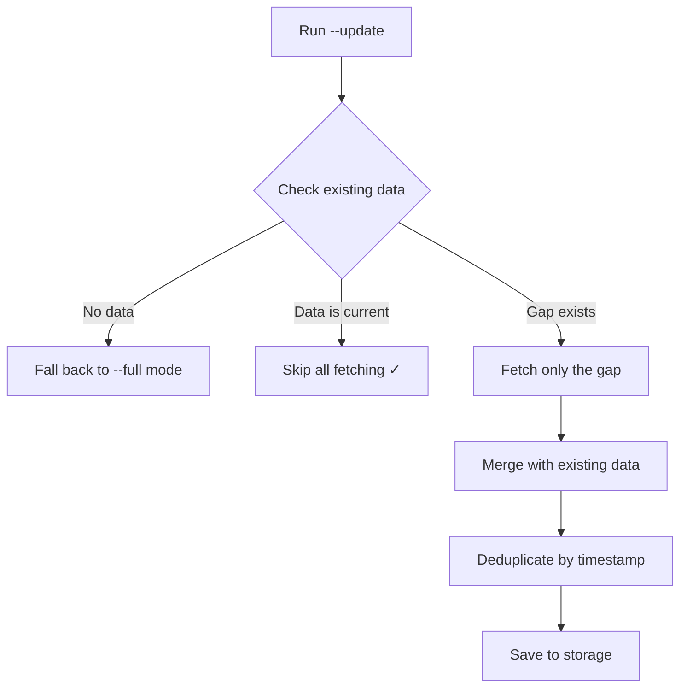
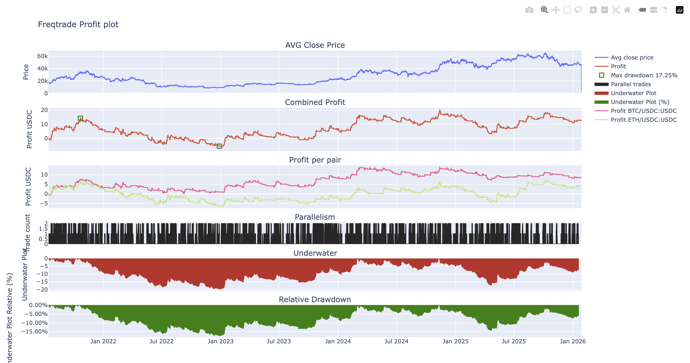
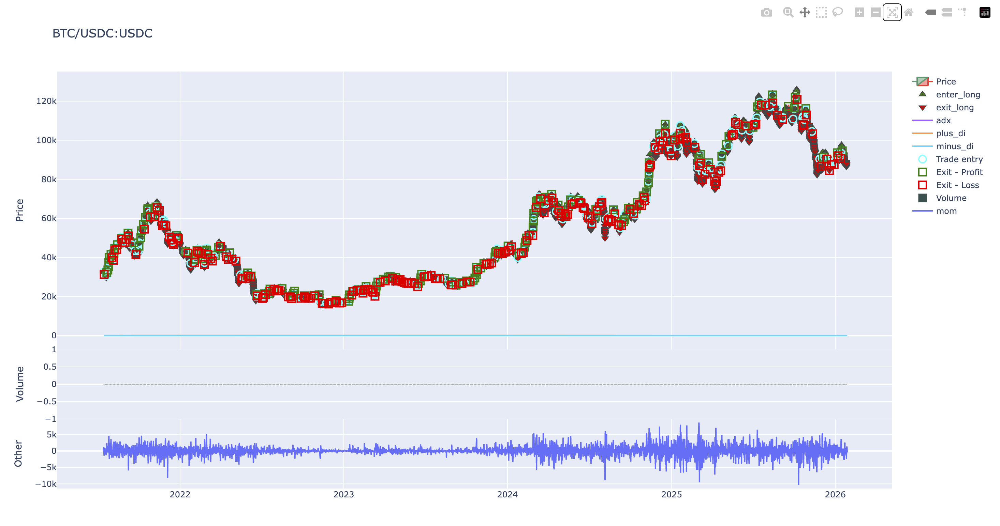
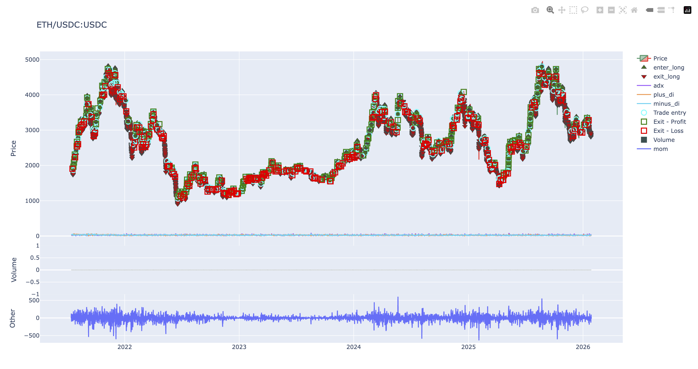

# GMX Historical Data Collection

Collect historical price data for all `118 GMX V2` tokens with **smart incremental updates**.

## Features

- ✅ **Smart Data Range Checking** - Only fetches data you don't have
- ✅ **Incremental Updates** - 10-30x faster than full collection for daily updates
- ✅ **Dual Data Sources** - GMX API (recent ~6 months) + Chainlink (historical)
- ✅ **118 GMX V2 Tokens** - 34 Chainlink markets + 84 non-Chainlink markets
- ✅ **6 Timeframes** - 1min, 5min, 15min, 1h, 4h, 1d
- ✅ **Freqtrade Compatible** - Direct export to Feather format (OHLCV + funding rate + mark price)
- ✅ **Gap Detection** - Identifies data loss from GMX API's sliding window
- ✅ **Concurrent Collection** - Parallel symbol processing and RPC batch requests

## Quick Start

```bash
# Install
poetry install

# Set environment variables
export JSON_RPC_ARBITRUM="https://arb-mainnet.g.alchemy.com/v2/YOUR_KEY"
export HYPERSYNC_API_TOKEN="your_token_here"  # Free from https://envio.dev

# Initial collection (takes 4-5 hours for all tokens)
gmx_historical_data collect --default --output-dir ./data --concurrency 5

# Chainlink-only collection (34 markets, no HyperSync needed)
gmx_historical_data collect --full --chainlink-only --output-dir ./data --concurrency 5

# Daily updates (takes 10-30 minutes for all tokens - 10-30x faster!)
gmx_historical_data collect --update --output-dir ./data --concurrency 10
```

## How Smart Incremental Updates Work

The collection system intelligently checks your existing data before fetching:



**Example: Daily Update for ETH**

```
# Check existing data
✓ 1h timeframe: Latest timestamp 2026-01-27 15:00:00

# Calculate gap
→ Need data from 2026-01-27 16:00:00 to now (24 candles)

# Fetch incrementally
→ 1h: Fetching from GMX API (incremental)
✓ 1h: 24 candles from GMX

# Merge and save
→ 1h: Merged 8,760 total candles (added 24 new)
✓ Chainlink backfill not needed - data is complete

# Total time: 15 seconds (vs 5+ minutes for --full)
```

**Key Optimizations:**

1. **Skip current data**: If your data is up-to-date, fetching is skipped entirely
2. **Fetch only gaps**: Only requests data from your latest timestamp to now
3. **Smart Chainlink backfill**: Only backfills if you need older historical data
4. **Efficient merging**: Concatenates and deduplicates in-memory before saving

## Incremental Oracle Events Collection (New!)

For the **84 non-Chainlink tokens**, the collector now uses **incremental oracle events collection** to dramatically reduce bandwidth and collection time.

### Features

- **Data Coverage Analysis** - Analyzes existing parquet files to determine what oracle events are missing
- **Block-Timestamp Cache** - Efficiently converts timestamps to block numbers without RPC calls
- **Gap-Only Fetching** - Only fetches oracle events for missing block ranges (50-99% bandwidth savings)
- **HyperSync Key Rotation** - Automatically rotates between multiple API keys to handle rate limits
- **Progressive Retry** - Exponential backoff for transient errors (2s → 60s delays)

### Quick Example

```bash
# Set up multiple HyperSync keys for rate limit protection
export HYPERSYNC_API_TOKEN="key1 key2 key3"  # Space-separated, free from https://envio.dev

# First run: Full collection from genesis
gmx_historical_data collect --symbol SUI --output-dir ./data

# Output:
# → Building block-timestamp cache...
# ✓ Cache built with 30,000 samples
# → No existing data found for SUI
# → Fetching oracle events: blocks 180,000,000 to 210,000,000 (30M blocks)
# ✓ Collected 50,000 oracle events (~10 minutes)

# Second run: Incremental update (only new data)
gmx_historical_data collect --symbol SUI --output-dir ./data

# Output:
# ✓ Using cached block-timestamp data
# → Analyzing existing coverage...
#   ✓ Found data covering 6 timeframes (earliest: 2024-10-01)
# → Fetching oracle events: blocks 180,000,000 to 195,001,000 (15M blocks)
# ✓ Collected 25,000 new oracle events (~5 minutes - 50% faster!)
```

### HyperSync Key Rotation Example

```bash
# Configure multiple keys
export HYPERSYNC_API_TOKEN="key1 key2 key3"

# Automatic rotation on rate limits
gmx_historical_data collect --default --output-dir ./data --concurrency 10

# Logs show rotation:
# [INFO] Initialized HyperSyncKeyRotator with 3 API key(s)
# [WARN] Rate limit detected on key #1 - rotating to key #2
# [SUCCESS] Collection succeeded after key rotation
```

### Performance Improvements

| Scenario | Before (Full) | After (Incremental) | Improvement |
|----------|---------------|---------------------|-------------|
| **Daily update (1 symbol)** | ~10 min, 30M blocks | ~5 min, 15M blocks | 50% faster, 50% less bandwidth |
| **Hourly update (1 symbol)** | ~10 min, 30M blocks | ~1 min, 500k blocks | 90% faster, 98% less bandwidth |
| **Daily update (84 symbols)** | ~14 hours | ~1-2 hours | 85-90% faster |
| **Bandwidth (daily)** | ~500 MB/symbol | ~8 MB/symbol | 98% reduction |

### Documentation

For detailed guide including troubleshooting, advanced configuration, and FAQs, see:

**[📘 Incremental Collection Guide](docs/incremental-collection.md)**

## Funding Rate Extraction (GMX V2)

Extract historical funding rates for all GMX V2 perpetual markets. Funding rates
use 30-decimal fixed-point precision (`fundingFactorPerSecond / 10^30`).

### Why Three Scripts? (Data Architecture)

GMX V2 changed how it exposes funding rates in the **V2.2 upgrade (August 2025)**:

- **Pre-V2.2 (Nov 2023 – Aug 2025)**: GMX stored `savedFundingFactorPerSecond` as
  a signed integer in the **DataStore contract** (state, not events). No on-chain
  event ever emitted the rate for this period. The only way to read historical values
  is via `eth_call` to the DataStore at specific past blocks — which requires an
  **archive node**. HyperSync cannot help here because it only indexes event logs.

- **V2.2+ (Aug 2025 – present)**: GMX introduced the `Funding` event on the
  `EventEmitter` contract, which emits `fundingFactorPerSecond` on every update.
  HyperSync can stream these events all the way back to V2.2 genesis, with no RPC
  needed.

- **`FundingFeeAmountPerSizeUpdated`** events exist across the full V2 history, but
  they carry **cumulative fee accumulators** — not the rate itself. They include
  open-interest amplification (~13×) and token pricing, making direct rate extraction
  impractical. We use them solely to detect **direction** (which side pays).

### Data Sources

| Script | Period | Data | Source |
|--------|--------|------|--------|
| `extract_funding_datastore.py` | Nov 2023 - Aug 2025 | Signed rate (correct direction) | Archive RPC + batched bytecode eth_call |
| `extract_funding_factor.py` | Aug 2025 - present | Rate magnitude (unsigned) | HyperSync events |
| `extract_funding_fee_per_size.py` | Aug 2023 - present | Direction (who pays) | HyperSync events |
| **`extract_unified_funding.py`** | **Combined** | **Direction-corrected rate** | **All sources** |

### Quick Start (Unified Script)

The unified script orchestrates all sources and merges into a single
direction-corrected `1h.parquet` per symbol.

```bash
# Install dependencies
poetry install

# Default: HyperSync phases + merge (fast, no archive RPC needed)
poetry run python scripts/extract_unified_funding.py

# Include pre-V2.2 DataStore phase (~200 batched HTTP requests, requires archive node)
export JSON_RPC_ARBITRUM=<archive-node-url>
poetry run python scripts/extract_unified_funding.py --include-datastore

# Single market
poetry run python scripts/extract_unified_funding.py --market ETH/USD

# Incremental update (resumes from per-phase checkpoints)
poetry run python scripts/extract_unified_funding.py --resume

# Output as feather instead of parquet
poetry run python scripts/extract_unified_funding.py --output feather

# Export to FreqTrade feather format (OHLCV with rate in 'open')
poetry run python scripts/extract_unified_funding.py --feather-dir ./user_data/data

# Both: feather merge + FreqTrade export
poetry run python scripts/extract_unified_funding.py --output feather --feather-dir ./user_data/data

# Merge only (skip extraction, combine existing data)
poetry run python scripts/extract_unified_funding.py --merge-only
```

### Using the Makefile

```bash
# Full extraction (HyperSync + merge)
make funding-unified

# With DataStore phase (slow)
make funding-unified INCLUDE_DATASTORE=1

# Incremental update
make funding-unified-resume

# Single market
make funding-unified MARKET="ETH/USD"

# Merge only
make funding-unified-merge
```

### How It Works

1. **Phase 2 — Funding Factor** (HyperSync): Streams `Funding` events for
   `fundingFactorPerSecond` magnitude (V2.2+, Aug 2025 onwards)
2. **Phase 3 — Direction** (HyperSync): Streams `FundingFeeAmountPerSizeUpdated`
   events, compares long vs short delta sums to determine who pays
3. **Phase 1 — DataStore** (opt-in): Reads signed `savedFundingFactorPerSecond`
   from the DataStore contract via batched `eth_call` at hourly intervals (pre-V2.2)
4. **Merge**: Combines all sources, applies direction correction to V2.2+ data,
   deduplicates, and writes unified `1h.parquet` (or `1h.feather` with `--output feather`)

### DataStore Performance

The DataStore phase uses **fully-batched JSON-RPC requests** across two prefetch phases —
all network I/O finishes before any record is written:

| Phase | Method | Batch size | Requests for full run |
|-------|--------|------------|----------------------|
| Timestamps | `eth_getBlockByNumber` batch | 200/request | ~87 HTTP requests |
| DataStore reads | `eth_call` batch | 150/request | ~116 HTTP requests |
| **Total** | | | **~203 HTTP requests** (vs. ~17,000 sequential) |

**How the `eth_call` batching works:**

Each HTTP request contains up to 150 JSON-RPC `eth_call` items. Each `eth_call` executes
`GMXFundingRateBatchRequest` — a **never-deployed Solidity contract** whose constructor
reads all ~124 market rates from the DataStore in a single EVM execution (computes
keccak keys on-chain, calls `getInt` for every market, returns `int256[]`). The contract
bytecode is embedded directly in the Python script; no deployment or Multicall3 dependency.

```
1 HTTP POST  →  150 × eth_call  →  each call reads all ~124 markets in one EVM run
              └─ JSON-RPC batch    └─ GMXFundingRateBatchRequest bytecode
```

Requests are distributed round-robin across all providers in `JSON_RPC_ARBITRUM`.

```bash
# Full run — ~203 HTTP requests, typically 2-5 minutes on an archive node
export JSON_RPC_ARBITRUM="https://rpc1.example.com https://rpc2.example.com"
poetry run python scripts/extract_funding_datastore.py

# Expected output:
#   HTTP batches:  87 timestamp + 116 DataStore = 203 total
#   Timestamps ready in ~65s
#   DataStore reads ready in ~90s
```

> **Archive node required.** Public RPC endpoints (Alchemy free tier, Infura) usually
> rate-limit `eth_call` at historical blocks. A dedicated Arbitrum archive node
> (e.g. Alchemy Growth, QuickNode) handles sustained parallel load without 429s.

### Output Structure

```
data/funding/arbitrum/
├── raw/
│   ├── funding/{SYMBOL}/partition=0/data.parquet   # Raw Funding events
│   └── fee_per_size/{SYMBOL}/data.parquet          # Raw fee-per-size events
├── rates/
│   ├── {SYMBOL}/1h.parquet                         # Unified hourly rates (merged)
│   ├── {SYMBOL}/1h_factor.parquet                  # HyperSync-only rates
│   └── {SYMBOL}/1h_datastore.parquet               # DataStore-only rates
├── direction/
│   └── {SYMBOL}/1h.parquet                         # Hourly direction (who pays)
└── checkpoints/
    ├── funding_factor_checkpoint.json
    ├── fee_per_size_checkpoint.json
    └── funding_datastore_checkpoint.json
```

### Unified Hourly Rates Schema (`rates/{SYMBOL}/1h.parquet`)

| Column | Type | Description |
|--------|------|-------------|
| `timestamp` | datetime[ms, UTC] | Hour start |
| `funding_rate` | float64 | Mean per-second rate |
| `funding_rate_hourly` | float64 | `rate * 3600` (used by FreqTrade) |
| `funding_rate_annualized` | float64 | `rate * 3600 * 8760` |
| `longs_pay_shorts` | bool | True = longs pay (direction-corrected) |
| `funding_fee_long` | float64 | Signed hourly rate for longs |
| `funding_fee_short` | float64 | Signed hourly rate for shorts |
| `update_count` | uint32 | Events in hour |
| `source` | string | `"datastore"` or `"hypersync"` |

### Expected Rates

| Metric | Value |
|--------|-------|
| Per-second rate | ~1e-10 to ~1e-9 |
| Hourly rate | ~3.6e-7 to ~3.6e-6 |
| Annualized | ~0.5% to ~10% |

### Daily Cronjob

```bash
0 2 * * * cd /path/to/gmx_historical_data && \
  poetry run python scripts/extract_unified_funding.py --resume >> logs/unified_funding.log 2>&1
```

### Running Individual Scripts

The three source scripts can still be run independently:

```bash
# Funding Factor only (V2.2+)
poetry run python scripts/extract_funding_factor.py --resume

# Direction only
poetry run python scripts/extract_funding_fee_per_size.py --resume

# DataStore only (pre-V2.2, requires archive RPC)
poetry run python scripts/extract_funding_datastore.py --resume
```

### Troubleshooting

**HyperSync 500 errors**: Both HyperSync scripts retry up to 15 times with
exponential backoff (capped at 2 minutes). The unified script additionally
retries each phase up to 3 times if it fails entirely.

**Unknown markets**: Market info is fetched dynamically from the GMX REST API and
cached for 24 hours in `~/.cache/gmx_historical_data/markets_arbitrum.json`. If a
newly listed market is missing, run with `--refresh-markets` to force a cache refresh.

**Rates look wrong**: Verify the raw `funding_factor_per_second` value.
Divide by `10^30` for the per-second decimal rate. Multiply by `3600 * 8760`
for annualized. Typical ETH/USD annual rate is ~2-5%.

## Borrowing Rate Extraction (GMX V2)

Extract the market-level `borrowingFactorPerSecond` from GMX V2 `Borrowing` events
using HyperSync. This is the **pre-computed on-chain borrowing rate** — the rate
charged to the dominant side (larger OI) and paid to LPs.

> **Why this matters:** The Dune Analytics query for GMX borrowing rates uses complex
> Method 1/Method 2 calculations from pool parameters. The on-chain `Borrowing` event
> gives the **actual rate** the protocol uses, which is simpler and more accurate.

### Quick Start

```bash
# Full historical extraction
poetry run python scripts/extract_borrowing_factor.py --from-block 120000000

# Quick smoke test (recent blocks, JSON output)
poetry run python scripts/extract_borrowing_factor.py \
  --from-block 433300000 --to-block 433400000 --output json

# Incremental mode (resumes from checkpoint)
poetry run python scripts/extract_borrowing_factor.py --resume

# Background daemon
poetry run python scripts/extract_borrowing_factor.py --resume --background

# Filter by market
poetry run python scripts/extract_borrowing_factor.py --resume --market "ETH/USD"
```

### How It Works

1. Queries HyperSync for `Borrowing` events (topic1 = `keccak("Borrowing")`) from
   the GMX V2 EventEmitter contract
2. Decodes `borrowingFactorPerSecond` as a 30-decimal fixed-point integer
   (divide by `10^30` for the per-second decimal rate)
3. Writes raw events to per-symbol Parquet files
4. Aggregates to hourly rates with derived columns (hourly, annualized)

### Output Structure

```
data/borrowing/arbitrum/
├── raw/borrowing/                        # Raw Borrowing events
│   ├── ETH/partition=0/data.parquet
│   ├── BTC/partition=0/data.parquet
│   └── .../
├── rates/                                # Hourly aggregated rates
│   ├── ETH/1h.parquet
│   ├── BTC/1h.parquet
│   └── .../
└── checkpoints/
    └── borrowing_factor_checkpoint.json  # Resume state
```

**Hourly rates schema** (`rates/{SYMBOL}/1h.parquet`):

| Column | Type | Description |
|--------|------|-------------|
| `timestamp` | datetime[ms, UTC] | Hour start |
| `borrowing_rate` | float64 | Mean per-second rate |
| `borrowing_rate_hourly` | float64 | `rate * 3600` |
| `borrowing_rate_annualized` | float64 | `rate * 3600 * 8760` |
| `update_count` | uint32 | Events in hour |
| `symbol` | string | Human-readable symbol |
| `market` | string | Market contract address |

### Expected Rates

Typical `borrowingFactorPerSecond` values (annualized):

| Market | Typical Annual Rate |
|--------|--------------------|
| BTC/USD | ~1-2% |
| ETH/USD | ~4-7% |
| SOL/USD | ~1-3% |
| Illiquid tokens | ~10-60%+ |

### Combining with Funding Rates

To compute the **net cost** of holding a position:

```
net_rate = funding_rate + borrowing_rate
```

Both scripts output hourly rates in the same format, so they can be joined on
`(timestamp, symbol)` in pandas/polars.

## Docker Usage (Recommended)

The easiest way to collect GMX data is using Docker Compose with 3 pre-configured options:

### Quick Start with Docker

```bash
# 1. Copy environment template
cp .env.example .env

# 2. Edit .env with your API keys
nano .env

# 3. Choose your collection option:

# Option 1: Collect everything (all 118 markets)
docker-compose --profile all up gmx-collect-all

# Option 2: Chainlink feed tokens only (34 markets)
docker-compose --profile chainlink up gmx-collect-chainlink-only

# Option 3: Custom symbols (user configurable)
SYMBOLS=ETH,BTC,SUI docker-compose --profile custom up gmx-collect-custom
```

### Docker Features

- ✅ **No Python/Rust installation needed** - Everything runs in containers
- ✅ **3 pre-configured profiles** - All markets, Chainlink-only, or custom
- ✅ **Incremental updates** - `--profile update` for daily updates
- ✅ **Data verification** - `--profile verify` to check data quality
- ✅ **Persistent storage** - Data and logs saved to `./data` and `./logs`
- ✅ **HyperSync key rotation** - Automatic rotation for rate limit protection

### Docker Profiles

| Profile | Markets | Duration (First Run) | Use Case |
|---------|---------|---------------------|----------|
| `all` | 118 | 6-8 hours | Complete dataset |
| `chainlink` | 34 | 2-3 hours | Major tokens only |
| `custom` | User defined | Varies | Specific tokens |
| `update` | All existing | 10-30 minutes | Daily updates |
| `verify` | N/A | 1-2 minutes | Quality check |

**See [Docker Usage Guide](docs/docker-usage.md) for detailed documentation.**

## Installation

**Prerequisites:** Python 3.11 or 3.12 (recommended), Rust toolchain (for hypersync)

```bash
# Install Rust (if needed)
curl --proto '=https' --tlsv1.2 -sSf https://sh.rustup.rs | sh

# Install dependencies
poetry install
```

## Usage

### Collect Data

```bash
# Initial collection: All 118 tokens (ETA 4-5 hours)
gmx_historical_data collect --default --output-dir ./data --concurrency 5

# Initial collection: Single token (ETA 2-3 minutes)
gmx_historical_data collect --default --symbol ETH --output-dir ./data

# Daily incremental update: Fast! (ETA 10-30 seconds per token)
gmx_historical_data collect --update --output-dir ./data --concurrency 10

# Verify data quality
gmx_historical_data verify --output-dir ./data
```

The `--default` flag uses `--full` mode to fetch recent data from GMX API (~6 months) and backfill historical data from Chainlink oracles where available. **N.B.** There are only around 34 tokens which have the chainlink price feeds as of making this tutorial.

**Tip:** After initial collection with `--default`, use `--update` mode for daily/hourly updates. It's **10-30x faster** because it only fetches new data.

### Export for Freqtrade

Exports OHLCV candles, funding rates, and mark prices in FreqTrade's feather format.
The output format is CCXT-compatible (`datetime64[ms, UTC]` timestamps, same column
layout as Binance/Hyperliquid).

```bash
# Export all data types (OHLCV + funding rate + mark price)
gmx_historical_data export-freqtrade --data-dir ./data --output-dir ./freqtrade_data

# Export specific symbols/timeframes
gmx_historical_data export-freqtrade --data-dir ./data --symbol ETH --symbol BTC --timeframe 1h
```

Output structure:

```
freqtrade_data/gmx/futures/
├── ETH_USDC_USDC-1h-futures.feather        # OHLCV candles
├── ETH_USDC_USDC-1h-funding_rate.feather   # Funding rate (open=rate, others=0)
├── ETH_USDC_USDC-1h-mark.feather           # Mark price (OHLCV proxy)
├── BTC_USDC_USDC-1h-futures.feather
├── BTC_USDC_USDC-1h-funding_rate.feather
├── BTC_USDC_USDC-1h-mark.feather
└── ...
```

Funding rate data is read from `data/funding/arbitrum/rates/{SYMBOL}/{timeframe}.parquet`
(generated by `collect-funding`).

### Run Backtests

GMX requires [gmx-ccxt-freqtrade](https://github.com/tradingstrategy-ai/gmx-ccxt-freqtrade) monkeypatch. Use the included `freqtrade-gmx` wrapper.

> **Important:** Install `freqtrade` and `web3-ethereum-defi` in a separate isolated environment. Freqtrade requires `pandas<3.0` which conflicts with this project's `pandas>=3.0`. Even though `web3-ethereum-defi` is a project dependency, a clean install in an isolated venv avoids dependency conflicts.

```bash
# Create isolated environment for freqtrade (not .venv - that's for poetry)
python -m venv freqtrade-venv && source freqtrade-venv/bin/activate
pip install "freqtrade>=2025.11" "web3-ethereum-defi[web3v7,ccxt]>=0.38" plotly
```

```bash
# Copy example config and customize
cp configs/adxmomentum_gmx.example.json configs/adxmomentum_gmx.json
# Edit configs/adxmomentum_gmx.json with your settings
```

**N.B.**: The following step is very essential as we are saving the data as [`parquet`](https://en.wikipedia.org/wiki/Apache_Parquet) file but `freqtrade` expects the data as [`feather`](https://en.wikipedia.org/wiki/Feather_file_format) file format. This exports OHLCV candles, funding rates, and mark prices.

```bash
# Export data to freqtrade format (OHLCV + funding rate + mark price)
gmx_historical_data export-freqtrade --data-dir ./data --output-dir ./user_data/data \
    --symbol BTC --symbol ETH --timeframe 1h
```

```bash
# Run backtest with GMX support
./freqtrade-gmx backtesting --config configs/adxmomentum_gmx.json \
    --strategy ADXMomentum --timerange 20210713-
```

You can keep the timerange blank. Then freqtrade will run the backtest on the highest range of data available.

### Example Backtest Results

```
Result for strategy ADXMomentum
                                                BACKTESTING REPORT                                                 
┏━━━━━━━━━━━━━━━┳━━━━━━━━┳━━━━━━━━━━━━━━┳━━━━━━━━━━━━━━━━━┳━━━━━━━━━━━━━━┳━━━━━━━━━━━━━━━━━┳━━━━━━━━━━━━━━━━━━━━━━┓
┃               ┃        ┃              ┃                 ┃              ┃                 ┃      Win  Draw  Loss ┃
┃          Pair ┃ Trades ┃ Avg Profit % ┃ Tot Profit USDC ┃ Tot Profit % ┃    Avg Duration ┃                 Win% ┃
┡━━━━━━━━━━━━━━━╇━━━━━━━━╇━━━━━━━━━━━━━━╇━━━━━━━━━━━━━━━━━╇━━━━━━━━━━━━━━╇━━━━━━━━━━━━━━━━━╇━━━━━━━━━━━━━━━━━━━━━━┩
│ BTC/USDC:USDC │    366 │         0.16 │           8.590 │         8.59 │ 2 days, 4:10:00 │      145     0   221 │
│               │        │              │                 │              │                 │                 39.6 │
│ ETH/USDC:USDC │    394 │         0.07 │           4.103 │          4.1 │ 1 day, 22:11:00 │      170     0   224 │
│               │        │              │                 │              │                 │                 43.1 │
│         TOTAL │    760 │         0.11 │          12.693 │        12.69 │ 2 days, 1:04:00 │      315     0   445 │
│               │        │              │                 │              │                 │                 41.4 │
└───────────────┴────────┴──────────────┴─────────────────┴──────────────┴─────────────────┴──────────────────────┘
                                         LEFT OPEN TRADES REPORT                                          
┏━━━━━━━┳━━━━━━━━┳━━━━━━━━━━━━━━┳━━━━━━━━━━━━━━━━━┳━━━━━━━━━━━━━━┳━━━━━━━━━━━━━━┳━━━━━━━━━━━━━━━━━━━━━━━━┓
┃  Pair ┃ Trades ┃ Avg Profit % ┃ Tot Profit USDC ┃ Tot Profit % ┃ Avg Duration ┃  Win  Draw  Loss  Win% ┃
┡━━━━━━━╇━━━━━━━━╇━━━━━━━━━━━━━━╇━━━━━━━━━━━━━━━━━╇━━━━━━━━━━━━━━╇━━━━━━━━━━━━━━╇━━━━━━━━━━━━━━━━━━━━━━━━┩
│ TOTAL │      0 │          0.0 │           0.000 │          0.0 │         0:00 │    0     0     0     0 │
└───────┴────────┴──────────────┴─────────────────┴──────────────┴──────────────┴────────────────────────┘
                                                 ENTER TAG STATS                                                  
┏━━━━━━━━━━━┳━━━━━━━━━┳━━━━━━━━━━━━━━┳━━━━━━━━━━━━━━━━━┳━━━━━━━━━━━━━━┳━━━━━━━━━━━━━━━━━┳━━━━━━━━━━━━━━━━━━━━━━━━┓
┃ Enter Tag ┃ Entries ┃ Avg Profit % ┃ Tot Profit USDC ┃ Tot Profit % ┃    Avg Duration ┃  Win  Draw  Loss  Win% ┃
┡━━━━━━━━━━━╇━━━━━━━━━╇━━━━━━━━━━━━━━╇━━━━━━━━━━━━━━━━━╇━━━━━━━━━━━━━━╇━━━━━━━━━━━━━━━━━╇━━━━━━━━━━━━━━━━━━━━━━━━┩
│     OTHER │     760 │         0.11 │          12.693 │        12.69 │ 2 days, 1:04:00 │  315     0   445  41.4 │
│     TOTAL │     760 │         0.11 │          12.693 │        12.69 │ 2 days, 1:04:00 │  315     0   445  41.4 │
└───────────┴─────────┴──────────────┴─────────────────┴──────────────┴─────────────────┴────────────────────────┘
                                                EXIT REASON STATS                                                 
┏━━━━━━━━━━━━━┳━━━━━━━┳━━━━━━━━━━━━━━┳━━━━━━━━━━━━━━━━━┳━━━━━━━━━━━━━━┳━━━━━━━━━━━━━━━━━┳━━━━━━━━━━━━━━━━━━━━━━━━┓
┃ Exit Reason ┃ Exits ┃ Avg Profit % ┃ Tot Profit USDC ┃ Tot Profit % ┃    Avg Duration ┃  Win  Draw  Loss  Win% ┃
┡━━━━━━━━━━━━━╇━━━━━━━╇━━━━━━━━━━━━━━╇━━━━━━━━━━━━━━━━━╇━━━━━━━━━━━━━━╇━━━━━━━━━━━━━━━━━╇━━━━━━━━━━━━━━━━━━━━━━━━┩
│         roi │   270 │         5.02 │         203.248 │       203.25 │ 2 days, 2:09:00 │  270     0     0   100 │
│ exit_signal │   490 │        -2.59 │        -190.555 │      -190.56 │ 2 days, 0:28:00 │   45     0   445   9.2 │
│       TOTAL │   760 │         0.11 │          12.693 │        12.69 │ 2 days, 1:04:00 │  315     0   445  41.4 │
└─────────────┴───────┴──────────────┴─────────────────┴──────────────┴─────────────────┴────────────────────────┘
                                                  MIXED TAG STATS                                                  
┏━━━━━━━━━━━┳━━━━━━━━━━━━━┳━━━━━━━━┳━━━━━━━━━━━━━━┳━━━━━━━━━━━━━━━┳━━━━━━━━━━━━━━┳━━━━━━━━━━━━━━━┳━━━━━━━━━━━━━━━━┓
┃           ┃             ┃        ┃              ┃    Tot Profit ┃              ┃               ┃      Win  Draw ┃
┃ Enter Tag ┃ Exit Reason ┃ Trades ┃ Avg Profit % ┃          USDC ┃ Tot Profit % ┃  Avg Duration ┃     Loss  Win% ┃
┡━━━━━━━━━━━╇━━━━━━━━━━━━━╇━━━━━━━━╇━━━━━━━━━━━━━━╇━━━━━━━━━━━━━━━╇━━━━━━━━━━━━━━╇━━━━━━━━━━━━━━━╇━━━━━━━━━━━━━━━━┩
│           │         roi │    270 │         5.02 │       203.248 │       203.25 │       2 days, │      270     0 │
│           │             │        │              │               │              │       2:09:00 │        0   100 │
│           │ exit_signal │    490 │        -2.59 │      -190.555 │      -190.56 │       2 days, │       45     0 │
│           │             │        │              │               │              │       0:28:00 │      445   9.2 │
│     TOTAL │             │    760 │         0.11 │        12.693 │        12.69 │       2 days, │      315     0 │
│           │             │        │              │               │              │       1:04:00 │      445  41.4 │
└───────────┴─────────────┴────────┴──────────────┴───────────────┴──────────────┴───────────────┴────────────────┘
                          SUMMARY METRICS                          
┏━━━━━━━━━━━━━━━━━━━━━━━━━━━━━━━┳━━━━━━━━━━━━━━━━━━━━━━━━━━━━━━━━━┓
┃ Metric                        ┃ Value                           ┃
┡━━━━━━━━━━━━━━━━━━━━━━━━━━━━━━━╇━━━━━━━━━━━━━━━━━━━━━━━━━━━━━━━━━┩
│ Backtesting from              │ 2021-07-14 11:00:00             │
│ Backtesting to                │ 2026-01-27 15:00:00             │
│ Trading Mode                  │ Isolated Futures                │
│ Max open trades               │ 2                               │
│                               │                                 │
│ Total/Daily Avg Trades        │ 760 / 0.46                      │
│ Starting balance              │ 100 USDC                        │
│ Final balance                 │ 112.693 USDC                    │
│ Absolute profit               │ 12.693 USDC                     │
│ Total profit %                │ 12.69%                          │
│ CAGR %                        │ 2.67%                           │
│ Sortino                       │ 0.49                            │
│ Sharpe                        │ 0.24                            │
│ Calmar                        │ 0.85                            │
│ SQN                           │ 0.76                            │
│ Profit factor                 │ 1.06                            │
│ Expectancy (Ratio)            │ 0.02 (0.04)                     │
│ Avg. daily profit             │ 0.008 USDC                      │
│ Avg. stake amount             │ 15 USDC                         │
│ Total trade volume            │ 22839.886 USDC                  │
│                               │                                 │
│ Best Pair                     │ BTC/USDC:USDC 8.59%             │
│ Worst Pair                    │ ETH/USDC:USDC 4.10%             │
│ Best trade                    │ BTC/USDC:USDC 6.57%             │
│ Worst trade                   │ ETH/USDC:USDC -10.70%           │
│ Best day                      │ 3 USDC                          │
│ Worst day                     │ -2.084 USDC                     │
│ Days win/draw/lose            │ 227 / 1105 / 318                │
│ Min/Max/Avg. Duration Winners │ 0d 00:00 / 12d 07:00 / 2d 06:44 │
│ Min/Max/Avg. Duration Losers  │ 0d 01:00 / 8d 19:00 / 1d 21:03  │
│ Max Consecutive Wins / Loss   │ 9 / 13                          │
│ Rejected Entry signals        │ 0                               │
│ Entry/Exit Timeouts           │ 0 / 0                           │
│                               │                                 │
│ Min balance                   │ 94.531 USDC                     │
│ Max balance                   │ 119.956 USDC                    │
│ Max % of account underwater   │ 17.25%                          │
│ Absolute drawdown             │ 19.701 USDC (17.25%)            │
│ Drawdown duration             │ 432 days 09:00:00               │
│ Profit at drawdown start      │ 14.232 USDC                     │
│ Profit at drawdown end        │ -5.469 USDC                     │
│ Drawdown start                │ 2021-10-21 09:00:00             │
│ Drawdown end                  │ 2022-12-27 18:00:00             │
│ Market change                 │ 110.57%                         │
└───────────────────────────────┴─────────────────────────────────┘

Backtested 2021-07-14 11:00:00 -> 2026-01-27 15:00:00 | Max open trades : 2
                                                 STRATEGY SUMMARY                                                  
┏━━━━━━━━━━━━━┳━━━━━━━━┳━━━━━━━━━━━━━━┳━━━━━━━━━━━━━━┳━━━━━━━━━━━━━━┳━━━━━━━━━━━━━━┳━━━━━━━━━━━━━━━┳━━━━━━━━━━━━━━┓
┃             ┃        ┃              ┃   Tot Profit ┃              ┃              ┃     Win  Draw ┃              ┃
┃    Strategy ┃ Trades ┃ Avg Profit % ┃         USDC ┃ Tot Profit % ┃ Avg Duration ┃    Loss  Win% ┃     Drawdown ┃
┡━━━━━━━━━━━━━╇━━━━━━━━╇━━━━━━━━━━━━━━╇━━━━━━━━━━━━━━╇━━━━━━━━━━━━━━╇━━━━━━━━━━━━━━╇━━━━━━━━━━━━━━━╇━━━━━━━━━━━━━━┩
│ ADXMomentum │    760 │         0.11 │       12.693 │        12.69 │      2 days, │     315     0 │  19.701 USDC │
│             │        │              │              │              │      1:04:00 │     445  41.4 │       17.25% │
└─────────────┴────────┴──────────────┴──────────────┴──────────────┴──────────────┴───────────────┴──────────────┘
```

~4.5 years of backtesting data with 760 trades using ADXMomentum strategy.


Example strategy: `examples/strategies/ADXMomentum.py`

### Plot Results

Generate interactive HTML charts for analysis:

```bash
# Plot profit/loss over time
./freqtrade-gmx plot-profit --config configs/adxmomentum_gmx.example.json --auto-open

# Plot individual pair with indicators
./freqtrade-gmx plot-dataframe --config configs/adxmomentum_gmx.example.json \
    --strategy ADXMomentum -p BTC/USDC:USDC --auto-open
```

Charts are saved to `user_data/plot/`:
- `freqtrade-profit-plot.html` - Cumulative profit chart
- `freqtrade-plot-BTC_USDC_USDC-1h.html` - Price chart with indicators and trade markers

#### Profit Chart



#### Price Chart with Indicators





## Data Structure

```
data/
├── candles/arbitrum/{SYMBOL}/                              # OHLCV candle data
│   ├── 1m.parquet
│   ├── 1h.parquet
│   └── 1d.parquet
├── funding/arbitrum/
│   ├── raw/
│   │   ├── funding/{SYMBOL}/partition=0/data.parquet       # Raw Funding events
│   │   └── fee_per_size/{SYMBOL}/data.parquet              # Raw fee-per-size events
│   ├── rates/{SYMBOL}/
│   │   ├── 1h.parquet                                     # Unified hourly rates (merged)
│   │   ├── 1h_factor.parquet                              # HyperSync-only rates
│   │   └── 1h_datastore.parquet                           # DataStore-only rates
│   ├── direction/{SYMBOL}/1h.parquet                       # Hourly direction (who pays)
│   └── checkpoints/
│       ├── funding_factor_checkpoint.json
│       ├── fee_per_size_checkpoint.json
│       └── funding_datastore_checkpoint.json
├── borrowing/arbitrum/
│   ├── raw/borrowing/{SYMBOL}/partition=0/data.parquet     # Raw Borrowing events
│   ├── rates/{SYMBOL}/1h.parquet                           # Hourly aggregated borrowing rates
│   └── checkpoints/borrowing_factor_checkpoint.json        # Borrowing resume checkpoint
└── raw/arbitrum/{SYMBOL}/                                  # Raw oracle events
```

## CLI Reference

| Command | Description |
|---------|-------------|
| `collect --default` | Collect GMX + Chainlink data (recommended, uses `--full` mode) |
| `collect --full` | Full historical collection (fetch all available data) |
| `collect --full --chainlink-only` | Collect only 34 Chainlink-feed markets (no HyperSync needed) |
| `collect --full --all-markets` | Collect all 118 markets (default, requires HyperSync) |
| `collect --update` | Incremental update (smart: only fetches new data) |
| `verify` | Verify data quality |
| `export-freqtrade` | Export OHLCV + funding rate + mark price to Freqtrade feather format |
| `debug-oracle` | Debug oracle events |

### Collection Modes: `--full` vs `--update`

The collection system has **smart data range checking** to avoid refetching data you already have.

#### `--full` Mode (Initial Collection)
Collects all available historical data:
- ✅ Fetches full GMX API window (~6 months of recent data)
- ✅ Backfills ALL Chainlink historical data (from genesis to GMX coverage start)
- ✅ Useful for: First-time collection, recovery from corrupted data

```bash
# Collect all data from scratch
gmx_historical_data collect --full --symbol ETH --output-dir ./data
```

#### `--update` Mode (Incremental Updates) ⚡
Smart incremental updates that check existing data first:
- ✅ **Checks existing data** before fetching
- ✅ **Skips fetching** if data is already current (NO_GAP)
- ✅ **Fetches only gaps** - from your latest timestamp to now (NORMAL_GAP)
- ✅ **Chainlink backfill** - only if you need older data than you have
- ✅ **Merges** new data with existing storage (deduplicates by timestamp)

```bash
# Daily incremental update (fast!)
gmx_historical_data collect --update --symbol ETH --output-dir ./data
```

**Performance Comparison:**

| Scenario | `--full` Mode | `--update` Mode | Speedup |
|----------|---------------|-----------------|---------|
| **Daily update (ETH)** | ~5-10 min (refetches all 500k+ Chainlink rounds) | ~10-30 sec (only new data) | **10-30x faster** ⚡ |
| **Hourly update (BTC)** | ~5-10 min | ~5-10 sec (or skipped if current) | **30-60x faster** ⚡ |
| **Fresh collection** | ~2-3 min | ~2-3 min (falls back to full) | Same |

**Examples:**

```bash
# Initial collection
gmx_historical_data collect --default --symbol ETH,BTC,SOL --output-dir ./data

# Daily updates (fast incremental)
gmx_historical_data collect --update --symbol ETH,BTC,SOL --output-dir ./data

# Update all 118 tokens incrementally
gmx_historical_data collect --update --output-dir ./data --concurrency 10
```

**When data is current:**
```
✓ 1min: Data is current, skipping GMX API fetch
✓ 5min: Data is current, skipping GMX API fetch
✓ 1h: Data is current, skipping GMX API fetch
✓ Chainlink backfill not needed - data is complete
```

**When gap exists:**
```
→ 1h: Fetching from GMX API (incremental)
✓ 1h: 24 candles from GMX (2026-01-27 to 2026-01-28)
→ 1h: Merged 8,760 total candles (added 24 new)
```

### Common Options

| Option | Description | Default |
|--------|-------------|---------|
| `--output-dir PATH` | Output directory | `./data` |
| `--symbol TEXT` | Token(s) - comma-separated for `collect`, repeatable for `export-freqtrade` | All tokens |
| `--chainlink-only` | Only collect 34 markets with Chainlink feeds (no HyperSync needed) | Off (all markets) |
| `--all-markets` | Collect all 118 markets including non-Chainlink (requires HyperSync) | On (default) |
| `--concurrency INT` | Parallelism level (see below) | `4` |

> **Note:** `collect` uses comma-separated: `--symbol ETH,BTC,SUI`
> `export-freqtrade` uses repeatable: `--symbol ETH --symbol BTC`

### Concurrency & Performance

The `--concurrency` option controls both:
- **Symbol parallelism**: How many tokens are processed simultaneously
- **RPC batch workers**: Concurrent Chainlink data fetchers (auto-capped at 8)

| `--concurrency` | Symbols parallel | RPC batch workers | Use case |
|-----------------|------------------|-------------------|----------|
| 1 | 1 | 1 | Slow/rate-limited RPC |
| 4 (default) | 4 | 4 | Balanced |
| 8 | 8 | 8 | Fast RPC endpoint |
| 10+ | 10+ | 8 (capped) | Maximum speed |

**Examples:**
```bash
# Default speed (4 parallel)
gmx_historical_data collect --default --output-dir ./data

# Fast collection (10 symbols + 8 RPC workers)
gmx_historical_data collect --full --output-dir ./data --concurrency 10

# Specific tokens with parallelism
gmx_historical_data collect --default --symbol ETH,BTC,SUI --concurrency 8
```

**Estimated times** (with `--concurrency 10`):

**Initial Collection (`--full` or `--default`):**
- Single token (Chainlink): ~2-3 minutes
- Single token (non-Chainlink): ~30-60 seconds
- All 118 tokens: ~4-5 hours

**Incremental Updates (`--update`):**
- Single token (daily update): ~10-30 seconds
- Single token (hourly update): ~5-10 seconds (or instant if current)
- All 118 tokens (daily update): ~10-30 minutes
- All 118 tokens (hourly update): ~5-10 minutes

> **Speedup:** Incremental updates are **10-30x faster** than full collection because they only fetch new data and skip unnecessary Chainlink backfills.

## Best Practices

### Setting Up Automated Updates

For production use, set up a cron job or systemd timer for incremental updates:

```bash
# Cron job: Update every hour
0 * * * * cd /path/to/gmx_historical_data && source .venv/bin/activate && gmx_historical_data collect --update --output-dir ./data --concurrency 10 >> /var/log/gmx-update.log 2>&1

# Cron job: Update daily at 2 AM
0 2 * * * cd /path/to/gmx_historical_data && source .venv/bin/activate && gmx_historical_data collect --update --output-dir ./data --concurrency 10 >> /var/log/gmx-update.log 2>&1
```

### Recommended Workflow

1. **Initial Setup** (once):
   ```bash
   # Collect all historical data
   gmx_historical_data collect --default --output-dir ./data --concurrency 5
   ```

2. **Regular Updates** (hourly/daily):
   ```bash
   # Fast incremental updates
   gmx_historical_data collect --update --output-dir ./data --concurrency 10
   ```

3. **Verification** (weekly):
   ```bash
   # Check data quality
   gmx_historical_data verify --output-dir ./data
   ```

4. **Export for Trading** (as needed):
   ```bash
   # Export OHLCV + funding rate + mark price to Freqtrade
   gmx_historical_data export-freqtrade --data-dir ./data --output-dir ./freqtrade_data
   ```

### Handling Data Gaps

The system automatically detects three types of data states:

1. **NO_GAP** - Data is current
   ```
   ✓ All timeframes up to date, skipping collection
   ```

2. **NORMAL_GAP** - Normal gap (incremental fetch)
   ```
   → 1h: Fetching from GMX API (incremental)
   → Merged 8,760 total candles (added 24 new)
   ```

3. **DATA_LOSS** - GMX API window moved past your data
   ```
   ⚠ Data loss detected in 2 timeframe(s)
   → Fetching from api_earliest (accepting loss)
   ```

**Tip:** For 1-minute timeframes, GMX API's window is only ~5 hours. Update more frequently to avoid data loss.

## Troubleshooting

### Poetry Install Failing

If `poetry install` hangs or fails:

```bash
# Clear poetry cache
poetry cache clear pypi --all

# Try with verbose output to see what's stuck
poetry install -vvv

# If dependency resolution is slow, try:
poetry install --no-cache
```

If poetry can't find a compatible Python version:
```bash
# Check Python version (needs 3.11 or 3.12)
python --version

# Use pyenv to install correct version
pyenv install 3.11
pyenv local 3.11
poetry env use python3.11
poetry install
```

> **Note:** Python 3.13 requires additional workarounds. Use Python 3.11 or 3.12 for easiest installation.

### HyperSync Build Errors

HyperSync requires Rust and Cap'n Proto. If `poetry install` fails:

**1. Install Rust toolchain:**
```bash
curl --proto '=https' --tlsv1.2 -sSf https://sh.rustup.rs | sh
source $HOME/.cargo/env
```

**2. Install Cap'n Proto:**
```bash
# Ubuntu/Debian
sudo apt-get install build-essential capnproto libcapnp-dev

# macOS
brew install capnp

# Fedora/RHEL
sudo dnf install capnproto capnproto-devel
```

**3. If still failing, try installing hypersync separately:**
```bash
pip install --no-cache-dir --use-pep517 "hypersync==0.7.17"
poetry install
```

> **Note:** hypersync 0.8.x has a build issue with a missing GitHub dependency. Use 0.7.x versions until this is resolved.

**4. Common errors:**
- `error: linker 'cc' not found` → Install build-essential/gcc
- `capnp/capnp.h: No such file` → Install libcapnp-dev
- `cargo not found` → Source cargo env: `source $HOME/.cargo/env`
- `PyO3's maximum supported version` → Use Python 3.11 or 3.12, or set `PYO3_USE_ABI3_FORWARD_COMPATIBILITY=1`

### Rate Limits

Add multiple HyperSync tokens (comma-separated):
```bash
export HYPERSYNC_API_TOKEN="token1,token2,token3"
```

Get free tokens at https://envio.dev

## Development

```bash
export JSON_RPC_ARBITRUM=$ARBITRUM_CHAIN_JSON_RPC
pytest tests/ -v
```
